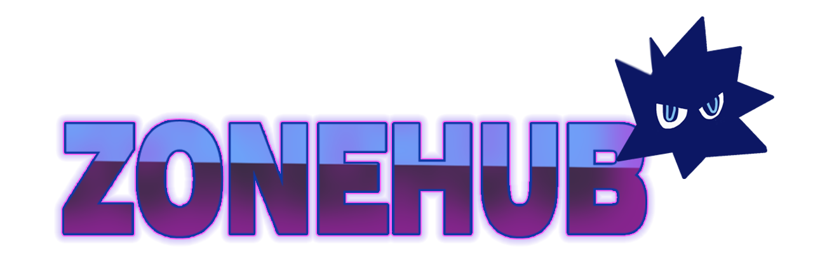
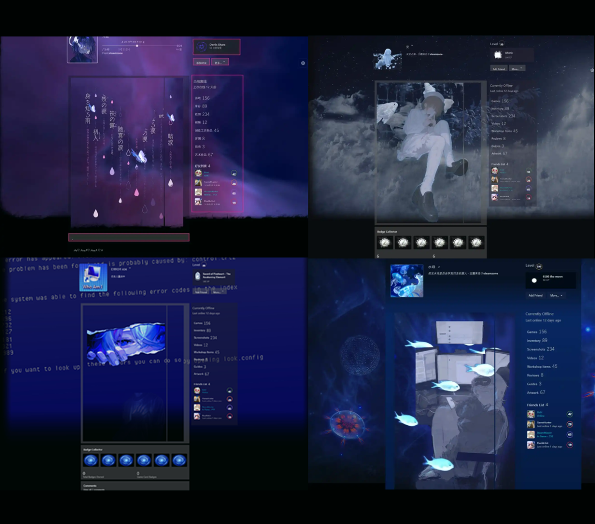

# ZoneHub

*Design your Steam-style profile locally — no sign-in, configs stay on your device.*

[](https://github.com/Tnekow/zonehub/releases)
[](LICENSE)
[](https://nodejs.org/)
[](https://github.com/Tnekow/zonehub/releases)
[](https://github.com/Tnekow/zonehub/stargazers)

Language: English | [简体中文](README.zh-CN.md)

ZoneHub is an **offline-first Electron desktop app** for designing high-fidelity Steam-style profile pages. Customize avatar, nickname, showcases, badges, themes, and background media entirely on your device — no Steam account or API required.


*Drag showcases → apply a dynamic background → export your layout.*

## Features

- **Offline-first** — core editing flows need no backend.
- **Steam-style layout** — high-fidelity profile presentation (visual reference only; not linked to Steam).
- **Drag-and-drop showcases** — custom sections, artwork, badges, workshop strips, and more.
- **Themes & backgrounds** — preset themes plus custom image/video URLs (`https`, `blob`, `data`).
- **Video backgrounds & video-to-GIF** — built-in tooling for animated profile backgrounds.
- **Config import/export** — save and restore layouts via local storage.
- **Electron desktop app** — primary development and usage target on Windows.
- **i18n** — `zh-CN`, `en-US`, `ja-JP`.

## Quick Start

### Download (recommended)

Get the latest Windows installer from [GitHub Releases](https://github.com/Tnekow/zonehub/releases) (`ZoneHub Setup *.exe`).

### Run from source (developers)

**Requirements:** Node.js `>=22`, npm `>=10`

```bash
npm install
npm run electron:dev
```

This starts the Vite dev server and opens the **Electron** desktop shell at `/desktop`. ZoneHub is developed and tested primarily as an Electron app — use this command for day-to-day work and when reporting issues.

### Build installer

```bash
npm run electron:build
```

Output: `dist/ZoneHub Setup *.exe`

> **Web dev mode (experimental):** `npm run dev` serves Vite at `http://127.0.0.1:5173/` — the root `/` is **not** the app entry. ZoneHub only mounts at `/desktop`. `npm run electron:dev` opens `/desktop` automatically; in a browser you must go there yourself. The web-only path may also have rendering or feature gaps — prefer `npm run electron:dev`.

<details>
<summary>Offline notes</summary>

- No online account or publish dependencies; app data stays in local storage.
- Custom background URLs: `https`, `blob`, and `data` only.
- If badge assets are missing after clone: `npm run badges:sync-assets`

</details>

## Screenshot Gallery

Different themes and backgrounds you can build with ZoneHub:



## Tech Stack

Vite · React 19 · TypeScript · Tailwind CSS · React Router · i18next · Electron

## License

This project is licensed under the **GNU Affero General Public License v3.0 only** (`AGPL-3.0-only`). See [LICENSE](LICENSE).

## Acknowledgments

- Sponsor: [朏朏Moonek0](https://steamcommunity.com/profiles/76561198933108580/)
- Community: [Discord](https://discord.gg/qpunvXZTvA)
- Support development: [Afdian](https://afdian.com/a/kuroiuz)

## Feedback & Contributing

- Bug reports and feature requests: [GitHub Issues](https://github.com/Tnekow/zonehub/issues)
- Contributions welcome: fork → branch → `npm run lint` → open a PR with motivation and test notes.

## Disclaimer

This project is for educational and personal use. It is not affiliated with Valve or Steam.
